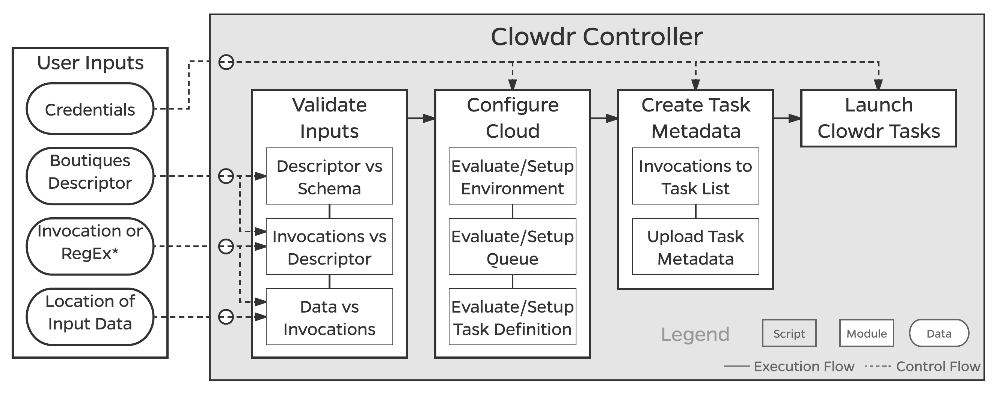
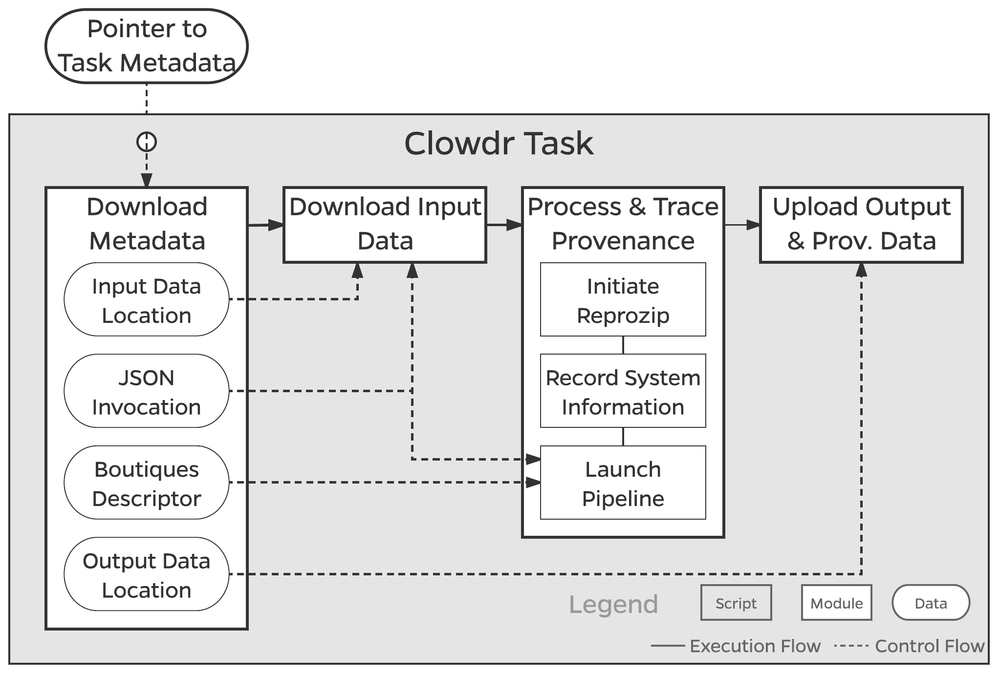

# Clowdr

*A Python-based microservice which runs launches arbitrary tools on arbitrary datasets in the cloud with a single line.*

[](https://zenodo.org/badge/latestdoi/85972485)
<!-- [](https://travis-ci.org/gkiar/clowdr)-->
<!-- [](https://coveralls.io/github/gkiar/clowdr?branch=master) -->
<!-- [](https://pypi.python.org/pypi/clowdr/) -->
<!-- [](https://pypi.python.org/pypi/clowdr/) -->
-----

*Clowdr* can be thought of as a cloud execution utility for [Boutiques](http://boutiques.github.io), the JSON-based
descriptive command-line framework. As Boutiques and the [Boutiques tools](https://github.com/boutiques/boutiques) allow
the encapsulation, validation, evaluation, and deployment of command-line routines, *Clowdr* inherits and extends this 
functionality to remote datasets and computational resources.

*Clowdr* is comprised of two key features: the **controller** and the **task**. The controller is the main user-facing 
function which accepts standard inputs pertaining to the tool and dataset to be used, and ultimately launches jobs 
encapsulated by a task. The task takes a pointer to the job metadata, fetches all relevant instructions and input data,
runs the job, and propagates back the results. A more in-depth description of these can be seen in the Figures below.
While typical users may only ever interact with the controller, tasks may be launched manually by developers to debug and 
verify their tool's execution.

<div style="text-align:center">


</div>

While initial development of *Clowdr* has been specific to the [Amazon Web Services](https://aws.amazon.com), the goal is
that this project will be extended to support the [Kubernetes](https://kubernetes.io/) cloud management software, and will 
be extensible to arbitrary captive or commercial clouds.

## System Requirements

- Docker

OR

- Python2.7 or newer
- Git client

## Installation Instructions

You can setup and use *Clowdr* either within Docker (plug and play) or natively on your computer (requiring some minor setup).

### Docker

To use *Clowdr* in Docker, simply pull the latest container(s) from DockerHub:

    docker pull gkiar/clowdr-controller

For users wishing to deploy their tool on the cloud immediately, the above container is sufficient. If you wish to perform 
local development and deployment as well, you must also download the task container:

    docker pull gkiar/clowdr-task


### Python

If you prefer to setup *Clowdr* locally, you may run:

    git clone https://github.com/gkiar/clowdr-dev
    cd clowdr-dev
    pip install -r requirements.txt

## Example

(to be improved)

1. We wish to run FSL's Brain Extraction Tool
2. The Boutiques descriptor for this, as a [BIDS app](https://bids-apps.neuroimaging.io), is [here](./examples/bet/descriptor.json)
3. We created a sample invocation for using this descriptor, [here](./examples/bet/invocation.json)
4. We uploaded our sample [BIDS dataset](http://bids.neuroimaging.io) to Amazon S3 at `s3://clowdr-storage/ds114/`
5. We launch our jobs with the following line:

```
docker run -ti -v ${PWD}:${PWD} -w ${PWD} gkiar/clowdr-controller \
                                            examples/bet/descriptor.json \
                                            examples/bet/invocation.json \
                                            credentials.csv \
                                            s3://clowdr-storage/ds114/ \
                                            s3://clowdr-storage/ds114/derivatives/bids-example/ \
                                            --bids -dv
```


## Getting Started (User)

(to be improved)

1. Find the Boutiques descriptor for the tool you wish to run - some of these for neuroimaging are available on [Neurolinks](https://brainhack101.github.io/neurolinks), for example
2. Put your data on Amazon S3
3. Draft an invocation with specific parameters you wish to use
4. Launch as follows (substituting your values):

```
python controller/controller.py \
         examples/bet/descriptor.json \
         examples/bet/invocation.json \
         credentials.csv \
         s3://clowdr-storage/ds114/ \
         s3://clowdr-storage/ds114/derivatives/bids-example/ \
         --bids -dv
```

## Getting Started (Developer)

(to be improved)

```
docker run -v /clowdata/:/clowdata/ \
           -v /var/run/docker.sock:/var/run/docker.sock \
           -e AWS_ACCESS_KEY_ID=${AWS_ACCESS_KEY} \
           -e AWS_SECRET_ACCESS_KEY=${AWS_SECRET_ACCESS_KEY} \
           --privileged \
           gkiar/clowdr-task:02012018 \
           s3://clowdr-storage/metadata.json
```
